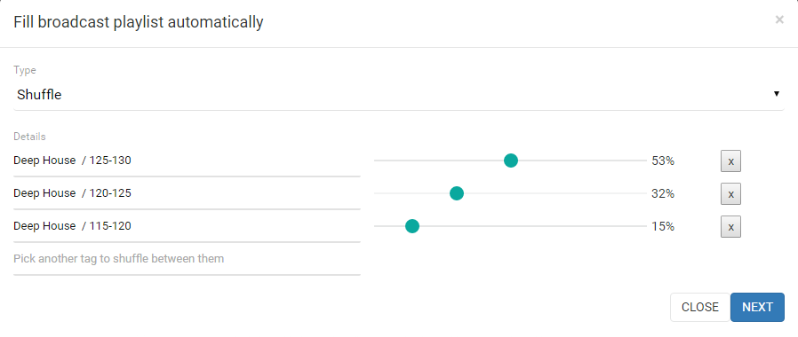

Getting Started
===============

What is Horn?
^^^^^^^^^^^^^

RadioKit Horn is a cloud-based playout, automation and a switch in one system.
You can scheduale content there or have a backup stream
in case of electrical surges or internet downtime. Also you can just
preprogram playlists, scheduale podcasts and pre-recorded shows that will play at the exact time and date you choose.
It can be used as an event studio which allows journalists to switch between streaming live
and scheduled playlists, jingles or commercials from the cloud.

Library - Depot
^^^^^^^^^^^^^^^

To be able to schedule your files you need to have a library first -
if you want to know how the Library works - please see http://docs-depot.radiokit.org
If in this docs you encounter some unclear terms like tag or repository -
you can find the explanation of these terms there as well.

Auto-scheduling
===============

Heart of the Horn is an automatic scheduler that allows you to scheduale a whole week of program for your radio.
This means you can define rules, which will controll your playlists and repeat them each week. (I.e. Sunday morning selection,
late Friday night selection etc).

This is the feature that is going to be further developed in future in order to satisfy most fastidious needs,
but for now its main function is to shuffle audio files from the group of chosen tags during a preselected time period within a single day or
several days of the week.

Creating a automatic scheduler
^^^^^^^^^^^^^^^^^^^^^^^^^^^^^^

To create a Automatic scheduler go to Broadcast/Auto.

Then click Add Automatic Scheduler.

.. image:: assets/horn_broadcast_auto.png

This will open up a pop up window, where you need to choose shuffle in the drop down menu.

Next thing you need to do is to pick tags you predifiend in the repositories from which you want the system to use the audio files.
You can pick multiple tags from different repositories.
If you choose more than one tag you can set the percentage of the tag presence in the scheduled playlist.

Next you just need to pick the days of the week and exact time, which is going to be
filled with this Automatic scheduler. Optionally you can name your Autoimatic Scheduler, so you can easily distinguish it later on (i.e. Monday morning chill, Weekend evening club list, etc.).
If you have more then one content type - you will have to choose to which content type this Automatic Scheduler belongs.

Click on the Add button and voila! You should see your automatic scheduler in the list.

(note: you won't see instant changes in the Broadcast/Schedule as the systems is planning the schedule
each minute just for a 30 minutes ahead, allowing you to program things manually as well)

Adding a single file in the scheduale
^^^^^^^^^^^^^^^^^^^^^^^^^^^^^^^^^^^^^

If you want to schedule a particular file at exact time and date follow the next steps.
Go to Broadcast/Schedule and click the button Add Track.
It will open for you a window with a live search engine that is going through all your repositories.
Auto-suggestion will pop-up to you with last files uploaded.
After you have done searching - you can specify the time when the file should start playing.
For obvious reasons you can't amend the end of the files, as its define by the file duration.
Optionally - you can change the name under which the file is going to show up in the playlist (it doesn't changes
the filename itself - just the name of this one execution).

If you have more then one content type - you will have to choose to which content type the rule belongs.

Content Types
^^^^^^^^^^^^^

Content types are made for the purpose of clear browsing and tracking past or future
broadcasts.

If you plan your schedule in blocks, like news, commercials, music, etc. -
you can create a content type for each of them. After you have done that - you can assign
the type at the end of both pop up window for automatic scheduling, and pop up window for adding
single files to the schedule.

Why should you do this? It will make your search through the schedule a lot easier,
and it will be more comfortable to track past broadcasts.

(note: You need to have at least one content type)

Workflow
========

To have an auto-generated playlist with rule defined by you, you need:
- have uploaded files that have assigned tags;
- move the files to Ready stage;
- create at least one content type (i.e. music)
- add an Automatic Scheduler for period of the week.

(note: system is planning the schedule for just a half an hour ahead, so probably you won't
see your changes instantly - they'll show up when its time come)

.. toctree::
   :maxdepth: 2
